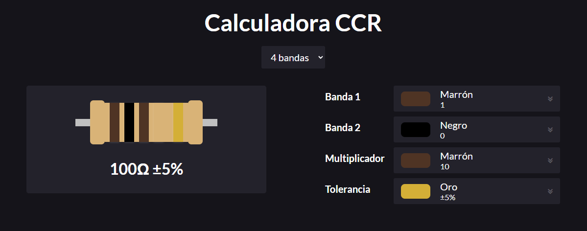
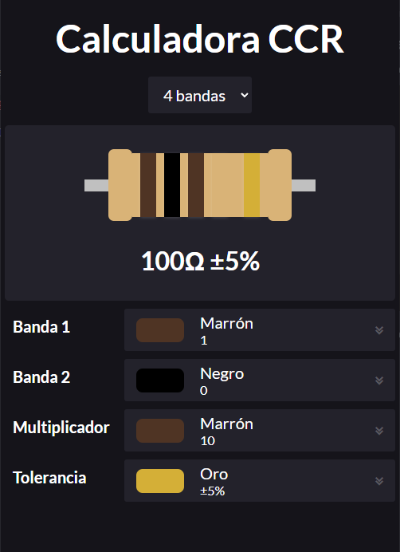

# Calculadora de Códigos de Colores de Resistencias

En este proyecto se creó una calculadora de códigos de colores de resistencias utilizando exclusivamente JS, HTML y CSS. Se utilizó CSS Grid para dar un comportamiento responsive al sitio web.

## Interfaz Gráfica

La interfaz en dispositivos de escritorio, se visualiza de la siguiente manera:

La interfaz en dispositivos de móviles, se visualiza de la siguiente manera:

